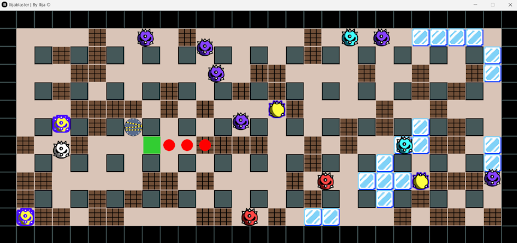
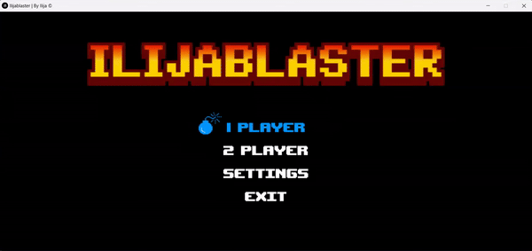

[](https://github.com/th0tmaker)


[](https://opensource.org/licenses/MIT)

<h1 align="center">BOMBERMAN</h1>

<h4 align="center">Written by th0tmaker in Python using the PyGame library.</h4>

<p align="center">
  <a href="#about">About</a> •
  <a href="#game-snippet">Game Snippet</a> •
  <a href="#installation">Installation</a> •
  <a href="#gameplay">Gameplay</a> •
  <a href="#controls">Controls</a> •
  <a href="#credits">Credits</a> •
  <a href="#license">License</a>
</p>

<p align="center">

</p>

## About
Bomberman, originally known as Bakudan Otoko (爆弾男), made its debut in Japan in July 1983. It was originally developed
by Hudson Soft, a video game developing company that is currently owned by Komani. Since its inception, Bomberman has
become a well-known classic, spawning a multitude of sequels and spin-offs across a multitude of gaming platforms.

In the game, players assume the role of Bomberman, a character navigating through a maze-like grid filled with obstacles
and adversaries. The primary objective is to strategically place bombs to destroy barriers, eliminate enemies,
and progress through to the next level.

The core mechanics of Bomberman revolve around laying bombs strategically to trap enemies or clear a path.
Players must carefully time their bomb placements to avoid getting caught in the explosions.
The game offers power-ups that enhance Bomberman's abilities, such as increasing the range of bomb explosions or
allowing him to lay multiple bombs at once.

Whether playing solo or with friends, Bomberman continues to entertain gamers of all ages with its simple yet engaging
gameplay and timeless charm.

## Game Snippet




## Installation

**On Itch.io**: (This installs the executable of the game along with required assets and audio folders). No external 
python files are provided).

1. Click this [link](https://beautifulmadness.itch.io/ilijablaster) to go to the game's Itch.io page.
2. Scroll down the page until you find the **Download** section, then click the DOWNLOAD button.
3. Below the download button, there is a section called **Install instructions**. Follow these instructions
to successfully install and run the game after you've downloaded the game's file.


**With Git**:

1. You must have [Git](https://git-scm.com/downloads) installed on your device and also
[Python](https://www.python.org/downloads/) and [PyGame](https://www.pygame.org/news).
2. On GitHub, go to the main page of the [repository](https://github.com/th0tmaker/PyGame).
3. Under the name of the repository, click Clone.
4. In the Clone with HTTPs section, click to copy the repository cloning URL.
5. Open Git Bash.
6. Change the current working directory to the location where you want the cloned directory to be made.
7. Type 'git clone', and then paste the URL that you copied in Step 2.

   ```$ git clone [.] https://github.com/th0tmaker/PyGame.git```
   
8. Press Enter. Your local clone will be created for [Pygame](https://github.com/th0tmaker/PyGame/). 
9. Find and access the Bomberman folder in the directory.
10. Run `__run__.py` in Python.

**Download ZIP**:

1. You must have [Python](https://www.python.org/downloads/) and [PyGame](https://www.pygame.org/news).
2. On GitHub, go to the main page of the [repository](https://github.com/th0tmaker/PyGame)
3. Under the name of the repository, click Code -> Download.
4. Extract the contents of the ZIP file to a desired location on your device.
5. Navigate to the extracted directory using the command prompt or terminal.
6. Find and access the Bomberman folder in the extracted directory.
7. Run `__run__.py` in Python.

**Copy/Paste code**:

1. You must have [Python](https://www.python.org/downloads/) and [PyGame](https://www.pygame.org/news).
2. On GitHub, go to the main page of the [repository](https://github.com/th0tmaker/PyGame/tree/master/Bomberman)
and click on the file you want to copy.
3. Once the file is open, click on the "Raw" button. This will display the raw text of the file.
4. Select all the code in the raw view and copy it.
5. Open a text editor or an Integrated Development Environment (IDE) on your local machine.
6. Create a new file in the text editor or IDE and paste the copied code into it.
7. Find and access the Bomberman folder in the directory.
8. Run `__run__.py` in Python.

## Gameplay:


Upon running the game, you will enter directly into the game's main menu where you can select three options:

In Settings, you can customize your game experience by adjusting the number of breakable walls and creeps in the game.
Alongside customizing your game experience, you can also adjust your audio settings, and player controls.

In Player 1 game mode, play solo against creeps (the game's enemy). Use keys to navigate and place bombs.
Defeat all enemies to gain access to the exit portal and win the game. 

Player 2 game mode adds multiplayer excitement. Compete against another Bomberman to be the last one standing.

There are several unique type of creeps in the game:

* Purple Creep (Normal): The standard adversary, represented by the color purple.
These creeps move in predictable patterns and pose a moderate threat.

* White Creep (Ghost): These elusive foes can pass through walls, making them difficult to predict and evade.
Watch out for their surprise attacks from unexpected angles.

* Red Creep (Rage): Upon defeat, these creeps enter a rage state, gaining increased speed and aggression.
Stay on your toes as these creeps can close distance quickly.

* Cyan Creep (Frost): These creeps spawn ice tiles as they move, creating slippery terrain that hinders Bomberman's
movement. Exercise caution to avoid slipping into danger.

* Yellow Creep (Transmutator): Masters of teleportation, these creeps can reappear in another body at different
locations within the maze. Stay vigilant and anticipate their sudden appearances.

In addition to facing off against various creeps, keep an eye out for power-ups scattered throughout the arena.
These power-ups offer permanent advantages to aid Bomberman in his quest for victory.

There are currently two power-ups available:

Explosion Radius Increase: Enhances the range of bomb explosions, making it easier to reach distant foes
and obstacles with greater ease.

Extra Bomb: Increases the bomb inventory and gives the player the ability to place additional bombs simultaneously.

## Controls:


*Keys:* 

(Can be customized in Menu -> Settings -> Controls)

<ins>PLAYER 1</ins>
* Navigate UP - <kbd>W</kbd>
* Navigate DOWN - <kbd>S</kbd>
* Navigate LEFT - <kbd>A</kbd>
* Navigate RIGHT - <kbd>D</kbd>
* Drop BOMB - <kbd>SPACE</kbd>

<ins>PLAYER 2</ins>
* Navigate UP - <kbd>↑</kbd>
* Navigate DOWN - <kbd>↓</kbd>
* Navigate LEFT - <kbd>←</kbd>
* Navigate RIGHT - <kbd>→</kbd>
* Drop BOMB - <kbd>L</kbd>

PAUSE GAME - <kbd>P</kbd>

## Credits
[th0tmaker](https://github.com/th0tmaker) - *"makeshift developer and maker of thots!"*

## License
This project is licensed under the terms of the MIT License. The MIT License is a permissive open source license that
allows you to freely use, modify, and distribute this software.
It provides you with the freedom to adapt the code to your needs, incorporate it into other projects,
and use it for commercial purposes. The only requirement is to include the original copyright and license notice in any
copies or derivatives of the software.