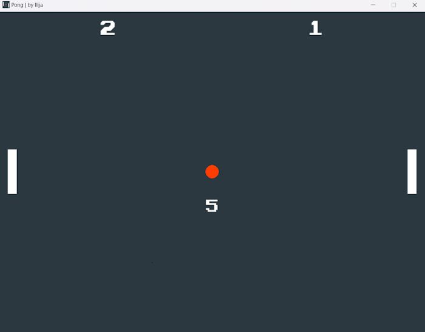
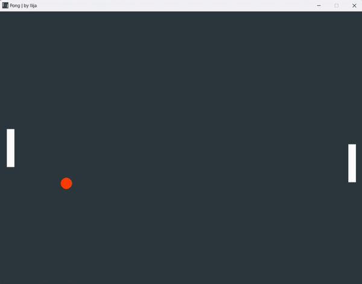
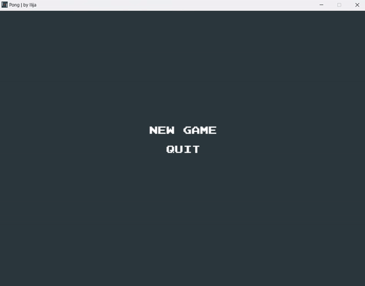

[](https://github.com/th0tmaker)


[](https://opensource.org/licenses/MIT)

<h1 align="center">PONG</h1>

<h4 align="center">Written by th0tmaker in Python using the PyGame library.</h4>

<p align="center">
  <a href="#about">About</a> •
  <a href="#game-snippet">Game Snippet</a> •
  <a href="#installation">Installation</a> •
  <a href="#gameplay">Gameplay</a> •
  <a href="#controls">Controls</a> •
  <a href="#credits">Credits</a> •
  <a href="#license">License</a>
</p>

<p align="center">

</p>

## About

Pong is a classic video game that holds a special place in the history of gaming.
Released in 1972 by Atari Inc., Pong is a pioneer of the industry and helped establish video gaming as a mainstream form
of entertainment. Created by Allan Alcorn, it was inspired by table tennis and features simple two-dimensional graphics
and intuitive gameplay mechanics. In Pong, players control paddles to hit a ball back and forth,
aiming to score points by outmaneuvering their opponent. The game's immense success transformed the gaming landscape,
ushering in the era of arcade gaming and paving the way for future advancements.
Despite its simplistic nature, Pong's timeless appeal and accessibility continue to make it a beloved classic,
symbolizing the early days of video gaming and serving as a touchstone for game designers and enthusiasts.


## Game Snippet
**In Game**:



**In Menu**



## Installation

**With Git**:

1. You must have [Git](https://git-scm.com/downloads) installed on your device and also
[Python](https://www.python.org/downloads/) and [PyGame](https://www.pygame.org/news).
2. On GitHub, go to the main page of the [repository](https://github.com/th0tmaker/PyGame/tree/master/Pong).
3. Under the name of the repository, click Clone.
4. In the Clone with HTTPs section, click to copy the repository cloning URL.
5. Open Git Bash.
6. Change the current working directory to the location where you want the cloned directory to be made.
7. Type 'git clone', and then paste the URL that you copied in Step 2.

   ```$ git clone [.] https://github.com/th0tmaker/PyGame/tree/master/Pong.git```
   
8. Press Enter. Your local clone will be created for [Pong](https://github.com/th0tmaker/PyGame/tree/master/Pong).
9. Run `__main__.py` in Python.

**Download ZIP**:

1. You must have [Python](https://www.python.org/downloads/) and [PyGame](https://www.pygame.org/news).
2. On GitHub, go to the main page of the [repositpry](https://github.com/th0tmaker/PyGame/tree/master/Pong)
3. Under the name of the repository, click Code -> Download.
4. Extract the contents of the ZIP file to a desired location on your device.
5. Navigate to the extracted directory using the command prompt or terminal.
6. Run `__main__.py` in Python.

**Copy/Paste code**:

1. You must have [Python](https://www.python.org/downloads/) and [PyGame](https://www.pygame.org/news).
2. On GitHub, go to the main page of the [repository](https://github.com/th0tmaker/PyGame/tree/master/Pong) and click on the file.
you want to copy.
3. Once the file is open, click on the "Raw" button. This will display the raw text of the file.
4. Select all the code in the raw view and copy it.
5. Open a text editor or an Integrated Development Environment (IDE) on your local machine.
6. Create a new file in the text editor or IDE and paste the copied code into it.
7. Run `__main__.py` in Python.

## Gameplay:

The current implementation of the game has only on available game mode, which is called 'Two Player Mode'.
In 'Two Player Mode', you can engage in a head-to-head match against yourself or another player.
In the menu, select 'New Game' to access this mode. The desired duration or point limit for the game are decided
by the players.

Before each round starts, a 10-second countdown timer initiates to give players ample time to prepare.
Once the countdown ends, the ball becomes active, and the game begins.
During the gameplay you also have the option to pause the game.
If you pause during the countdown timer phase, the round and countdown timer will reset back to the start.
If you pause after the countdown timer phase, the game will pause while preserving the game score and all relevant game data.

## Controls:

**Menu:**

*Mouse*
* Navigate Menu - Move mouse...
* Confirm Selection - <kbd>Left Mouse Click</kbd>


*Keys:* 
* Navigate UP - <kbd>&uparrow;</kbd>
* Navigate DOWN - <kbd>&downarrow;</kbd>
* Confirm Selection - <kbd>ENTER</kbd>


**Left Paddle:**

* Move UP - <kbd>W</kbd>
* Move DOWN - <kbd>S</kbd>

**Right Paddle:** 

* Move UP - <kbd>O</kbd>
* Move DOWN - <kbd>L</kbd>

**Pause:**

* Pause game - <kbd>ESC</kbd> (while in game)
* Unpause game - <kbd>ESC</kbd> (while in menu)

## Credits
[th0tmaker](https://github.com/th0tmaker) - *"makeshift developer and maker of thots!"*

## License
This project is licensed under the terms of the MIT License. The MIT License is a permissive open source license that allows you to freely use, modify, and distribute this software. It provides you with the freedom to adapt the code to your needs, incorporate it into other projects, and use it for commercial purposes. The only requirement is to include the original copyright and license notice in any copies or derivatives of the software.
