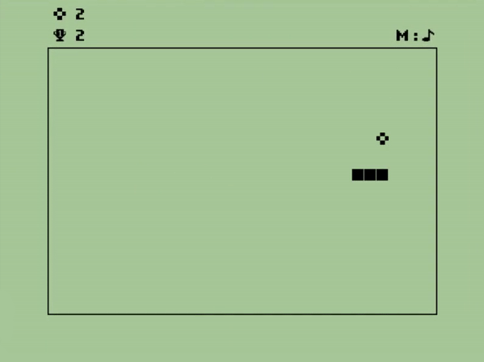
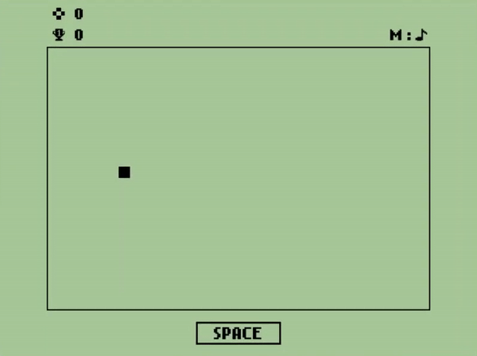

[](https://github.com/th0tmaker)


[](https://opensource.org/licenses/MIT)

<h1 align="center">SNAKE</h1>

<h4 align="center">Written by th0tmaker in Python using the PyGame library.</h4>

<p align="center">
  <a href="#about">About</a> •
  <a href="#game-snippet">Game Snippet</a> •
  <a href="#installation">Installation</a> •
  <a href="#gameplay">Gameplay</a> •
  <a href="#controls">Controls</a> •
  <a href="#credits">Credits</a> •
  <a href="#license">License</a>
</p>

<p align="center">

</p>

## About
Snake is one of the most recognizable classics in video game history. While the fundamental mechanics and concept of the
game can be traced back to the late 1970s, it wasn't until the 1990s that the most renowned version, simply known as
'Snake', gained more casual recognition. The game's popularity skyrocketed even further with its integration into late
1990s and early 2000s Nokia mobile phones, making it one of the earliest and most played mobile games ever made. 

The rules of the game are simple. The player takes control of a moving object that represents a snake.
The objective of the game is to guide the snake through a confined area, such as a grid or a maze. The main goal of the 
game is to accumulate as many points as possible by colliding with objects within the game, typically depicted as food.
As the snake consumes more food objects, it grows in size, introducing a linear difficulty progression curve.
The player is expected to exercise caution and skillfully maneuver the snake to avoid collisions with any of the walls
or the snake's own body..  

## Game Snippet



## Installation

**With Git**:

1. You must have [Git](https://git-scm.com/downloads) installed on your device and also
[Python](https://www.python.org/downloads/) and [PyGame](https://www.pygame.org/news).
2. On GitHub, go to the main page of the [repository](https://github.com/th0tmaker/PyGame).
3. Under the name of the repository, click Clone.
4. In the Clone with HTTPs section, click to copy the repository cloning URL.
5. Open Git Bash.
6. Change the current working directory to the location where you want the cloned directory to be made.
7. Type 'git clone', and then paste the URL that you copied in Step 2.

   ```$ git clone [.] https://github.com/th0tmaker/PyGame.git```
   
8. Press Enter. Your local clone will be created for [Pygame](https://github.com/th0tmaker/PyGame).
9. Run `__run__.py` in Python.

**Download ZIP**:

1. You must have [Python](https://www.python.org/downloads/) and [PyGame](https://www.pygame.org/news).
2. On GitHub, go to the main page of the [repository](https://github.com/th0tmaker/PyGame)
3. Under the name of the repository, click Code -> Download.
4. Extract the contents of the ZIP file to a desired location on your device.
5. Navigate to the extracted directory using the command prompt or terminal.
6. Run `__run__.py` in Python.

**Copy/Paste code**:

1. You must have [Python](https://www.python.org/downloads/) and [PyGame](https://www.pygame.org/news).
2. On GitHub, go to the main page of the [repository](https://github.com/th0tmaker/PyGame/tree/master/Snake)
and click on the file you want to copy.
3. Once the file is open, click on the "Raw" button. This will display the raw text of the file.
4. Select all the code in the raw view and copy it.
5. Open a text editor or an Integrated Development Environment (IDE) on your local machine.
6. Create a new file in the text editor or IDE and paste the copied code into it.
7. Run `__run__.py` in Python.

## Gameplay:

In order to start the game, the player needs to press the **'SPACE'** key. 
To play, use the keyboard to guide the snake and collect as many food objects as possible. Each food object is worth
**ONE** point. The current point total gets dynamically updated while the game is in progress and is displayed in the
top-right side of the game area surface. Below it there's also a graphic for displaying the high score,
which will store and display the game's highest score even when the game has been closed and re-opened. If the player
collides with any part of the snake's body or any of the walls confining the game area, the game will be over. 
Additionally, if the player wishes to mute the in game music, they can do so by pressing the 'M' key.  

## Controls:


*Keys:* 
* START Game - <kbd>Space</kbd>
* Navigate UP - <kbd>W</kbd>
* Navigate DOWN - <kbd>S</kbd>
* Navigate LEFT - <kbd>A</kbd>
* Navigate RIGHT - <kbd>D</kbd>


* Toggle Music - <kbd>M</kbd>

## Credits
[th0tmaker](https://github.com/th0tmaker) - *"makeshift developer and maker of thots!"*

## License
This project is licensed under the terms of the MIT License. The MIT License is a permissive open source license that
allows you to freely use, modify, and distribute this software.
It provides you with the freedom to adapt the code to your needs, incorporate it into other projects,
and use it for commercial purposes. The only requirement is to include the original copyright and license notice in any
copies or derivatives of the software.